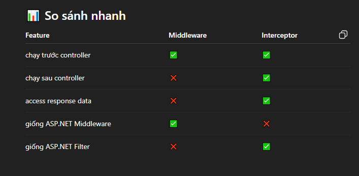
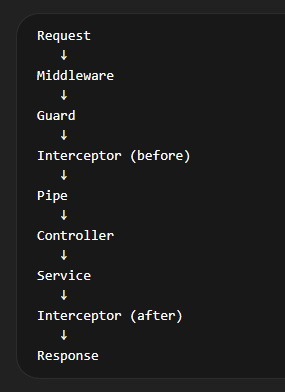
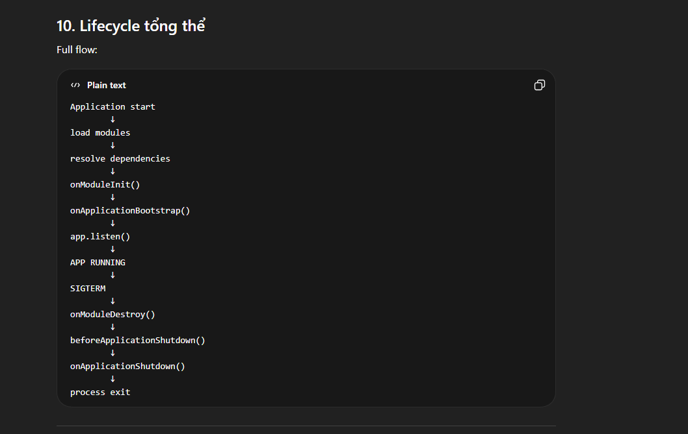

## Controllers

+ Nest built on top of Fasty or Express default
+ Subdomain routing
+ Query
+ Param
+ Body
+ using Res or dafult behavior of Nest. it can combine "passthrough"


### Providers: is a Instance of Service

+ Contructor inject cause problem when has child class -> use Property inject instead
+ Provider registortation: {import, controllers, **providers**, export}


### Modules
+ App has **Root Module** -> module graph

``` js
    {
        providers: "instance service class will be resolve in current module",
        controllers: "instance controller",
        imports: "the list of **other module** that **providers** must be **export** of them is need in current module",
        exports: "the providers of current available for othters. I want other modules that import this module to use this provider. (same like public API)". 
    }
```

+ Feature Module
+ Module re-export: export the imported module
+ Global module: @Global(). from now dont need to import this module
+ Dynamic module: resolve by current options, overide defaut decorator @Module({})


### Middlewares 

+ before routing, req res next()
+ thứ tự chạy khác so với .NET
+ can apply for route, exlude routes, for method (.NET apply full)
+ Middleware consumer: manage middleware chain. or app.user({{middlware}})
+ function middleware, class middleware


### Exception Filter

### Pipes

+ Transform data
+ Validate data before route

### Guard
+ CanActive?(): boolean
+ Roles base authorize

### Interceptor
+ before() -> handle() -> after()
+ transform response, 

### Custom decorator 
``` js
    {
        provide: 'service đại diện',
        useValue: null,
        useClass: null,
        useFactory: 'function có hoặc k có DI'
    }
```

+ provider thường: Class -> Class
+ asycn + useFactory: for async init

### Dynamic Module
+ function từ class nào đó tạo ra các keys của 1 @Module decorator
+ được cấu hình lúc Import


### Injection scope:
+ CatsController <- CatsService <- CatsRepository: if CatsService is scope -> Controller scoped too.
+ Ngắn giữ dài: ok. Dài giữ ngắn -> ngắn
+ If cicular => use forwardRef


### Module ref
+ get: singleton
+ resolve: scoped & transient: mỗi lần gọi tạo instance mới hoac instance cu~: ContextIdFactory

### Lazy module

### Excution Context
+ Thông tin Request, Handler, Response hiện tại: ExcutionContext & ArgumentHost

+ Reflector: đọc decorator từ class

### LifeCircle hooks


### Discovery Service
+ DiscoveryService = runtime scanner của NestJS container
+ Usecase:
    ``` js
    plugin system
    framework extension
    auto registration
    custom decorators system
    ```

