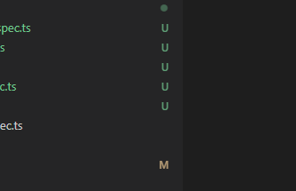

## Controller

Nest built on top of Fasty or Express default
Subdomain routing
Query
Param
Body
using Res or dafult behavior of Nest. it can combine "passthrough"

### Provider
Contructor inject cause problem when has child class -> use Property inject instead
Provider registortation: {import, controllers, providers, export}

